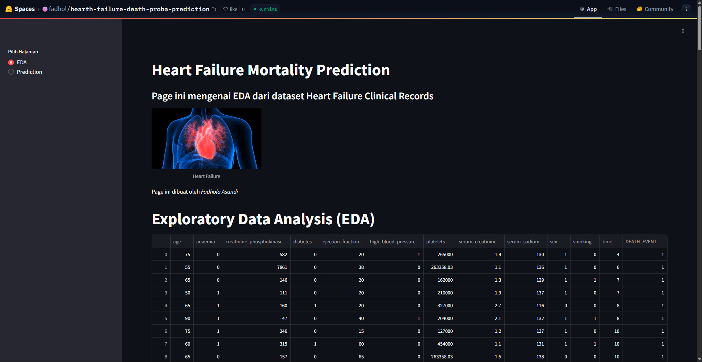
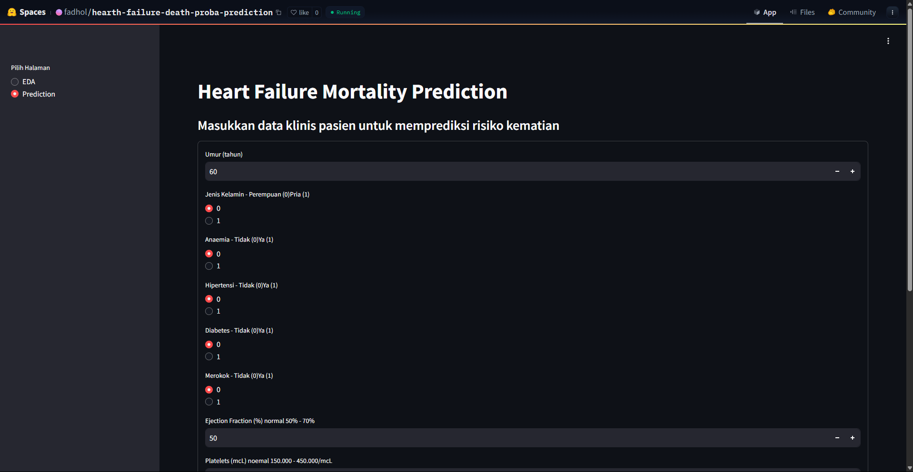
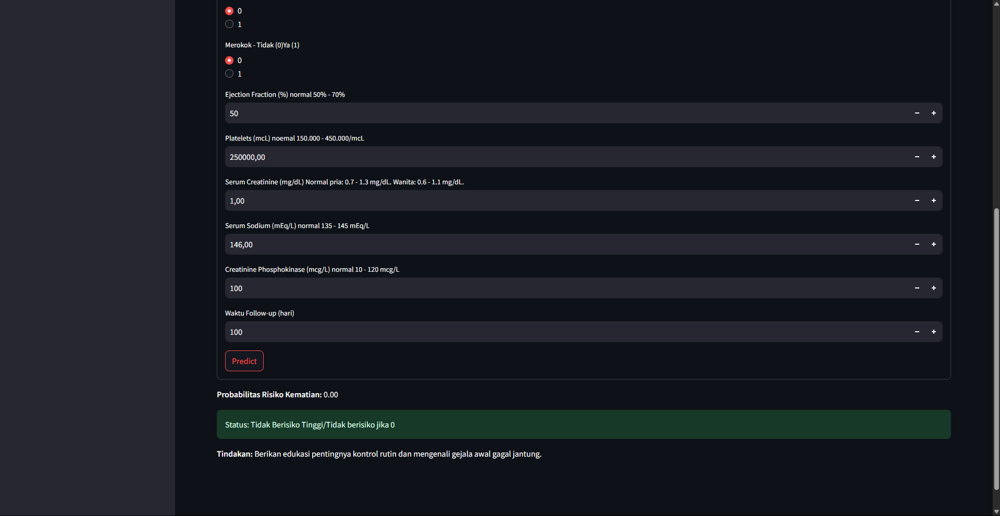

# Heart Failure Mortality Prediction

## Repository Outline

```
1. README.md - Penjelasan gambaran umum project.
2. notebook.ipynb - Proses end-to-end: preprocessing, EDA, modeling, evaluasi, dan tuning.
3. inference.ipynb - Proses inference dari model yang sudah jadi.
4. url.txt - URL dataset dan URL Deployment
5. heart_failure_clinical_records_dataset.csv - Dataset utama dari UCI Machine Learning Repository.
6. deploymeny/app.py - Berisi kode dari streamlit_app.
7. deploymeny/eda.py - Berisi kode dari EDA.
8. deploymeny/prediction.py - Berisi kode prediction.
9. deploymeny/model.pkl - File model XGBoost final yang telah disimpan.
```

## Problem Background

Gagal jantung merupakan salah satu penyebab utama kematian di dunia. Proyek ini bertujuan untuk memprediksi risiko kematian pasien yang menderita gagal jantung berdasarkan data klinis mereka. Dengan model klasifikasi, pasien yang memiliki risiko tinggi dapat diberikan edukasi dan tindakan preventif lebih awal, sementara yang tidak berisiko tinggi tetap diberikan edukasi terkait gejala dan pentingnya kontrol rutin.

## Project Output

Output dari project ini adalah model machine learning (XGBoost Classifier) untuk klasifikasi risiko kematian pasien gagal jantung dan output dari model tidak hanya berupa label klasifikasi (meninggal atau tidak), namun juga memberikan probabilitas kematian. Berdasarkan nilai probabilitas ini, pasien akan dikategorikan ke dalam tiga tingkat risiko (tinggi, sedang, rendah/tidak berisiko), dan setiap kategori diberikan rekomendasi tindakan medis atau edukasi yang sesuai. Juga terdapat evaluasi performa dan file model yang siap disimpan dan digunakan kembali.

## Data

Dataset diambil dari [UCI Machine Learning Repository](https://archive.ics.uci.edu/dataset/519/heart+failure+clinical+records) dengan judul **Heart Failure Clinical Records**. Dataset berisi 13 fitur klinis dan satu target (`death_event`) dari total 299 pasien. Data tidak memiliki missing values dan sudah dalam bentuk numerik/biner sehingga relatif siap digunakan.

## Method

Project ini menggunakan pendekatan supervised learning dengan model klasifikasi. Beberapa model dicoba, namun fokus akhirnya pada XGBoost Classifier. Model dievaluasi menggunakan **Recall** sebagai metrik utama, mengingat pentingnya meminimalkan False Negative dalam kasus medis seperti ini. Model juga divalidasi menggunakan cross-validation dan dilakukan hyperparameter tuning.

## Stacks

- **Bahasa Pemrograman**: Python
- **Environment**: Jupyter Notebook
- **Libraries dan Tools yang Digunakan**:
  - `pandas`, `numpy` – manipulasi dan analisis data
  - `matplotlib`, `seaborn` – visualisasi data
  - `scipy.stats` – uji statistik seperti chi-square dan korelasi Kendall
  - `sklearn` – preprocessing, pemodelan, evaluasi, dan pipeline machine learning
    - `KNeighborsClassifier`, `SVC`, `DecisionTreeClassifier`, `RandomForestClassifier`
    - `train_test_split`, `MinMaxScaler`, `ColumnTransformer`, `make_pipeline`
    - `classification_report`, `confusion_matrix`, `cross_val_score`, `roc_auc_score`, dll.
  - `feature_engine.outliers` – penanganan outlier dengan Winsorizer
  - `xgboost` – model boosting untuk klasifikasi
  - `pickle` – menyimpan model dalam format `.pkl`

## Screenshoot Deployment

#### EDA

<p align="center">
  
</p>

#### Prediction APP

<p align="center">
  
</p>
<p align="center">
  
</p>

## Reference

- URL deployment https://huggingface.co/spaces/fadhol/hearth-failure-death-proba-prediction
- Dataset: https://archive.ics.uci.edu/dataset/519/heart+failure+clinical+records
- Studi pendukung:
  - https://pharmaceutical-journal.com/article/news/chronic-heart-failure-deaths-could-fall-by-3000-per-year-following-updated-guidance-says-nice
  - https://www.medscape.com/viewarticle/nice-recommends-earlier-treatments-chronic-heart-failure-2025a1000flk
  - https://scitechdaily.com/startling-health-risk-normal-sodium-levels-linked-to-heart-failure/

---

## Objective

Model ini ditujukan untuk membantu masyarakat umum yang ingin mengecek potensi risiko kematian akibat gagal jantung berdasarkan atribut-atribut klinis yang dimiliki, dengan fokus pada edukasi dan deteksi dini.

## Features Used (13 Clinical Features)

- `age` (usia pasien)
- `anaemia` (anemia, boolean)
- `creatinine_phosphokinase` (enzim CPK, mcg/L)
- `diabetes` (boolean)
- `ejection_fraction` (persentase fungsi pompa jantung, %)
- `high_blood_pressure` (boolean)
- `platelets` (trombosit, kiloplatelets/mL)
- `sex` (0: wanita, 1: pria)
- `serum_creatinine` (fungsi ginjal, mg/dL)
- `serum_sodium` (natrium darah, mEq/L)
- `smoking` (kebiasaan merokok, boolean)
- `time` (durasi follow-up, hari)
- `death_event` (target: meninggal/tidak)

---
